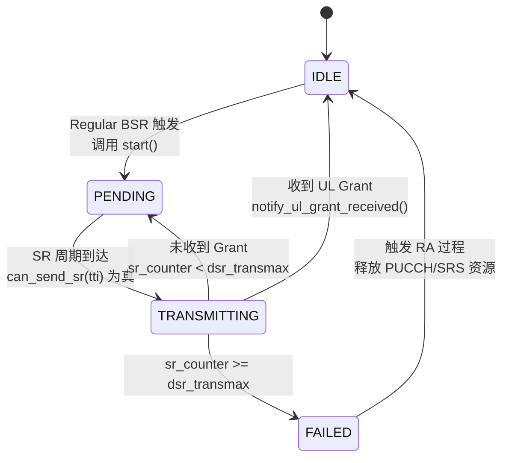
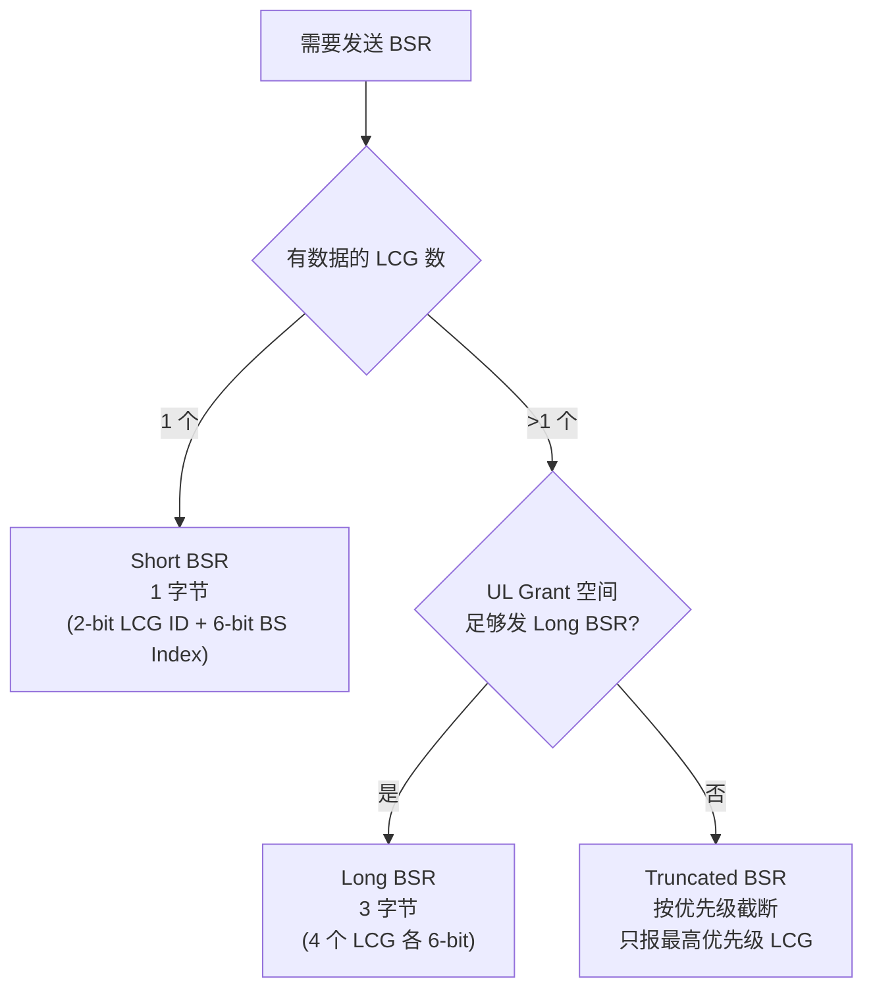
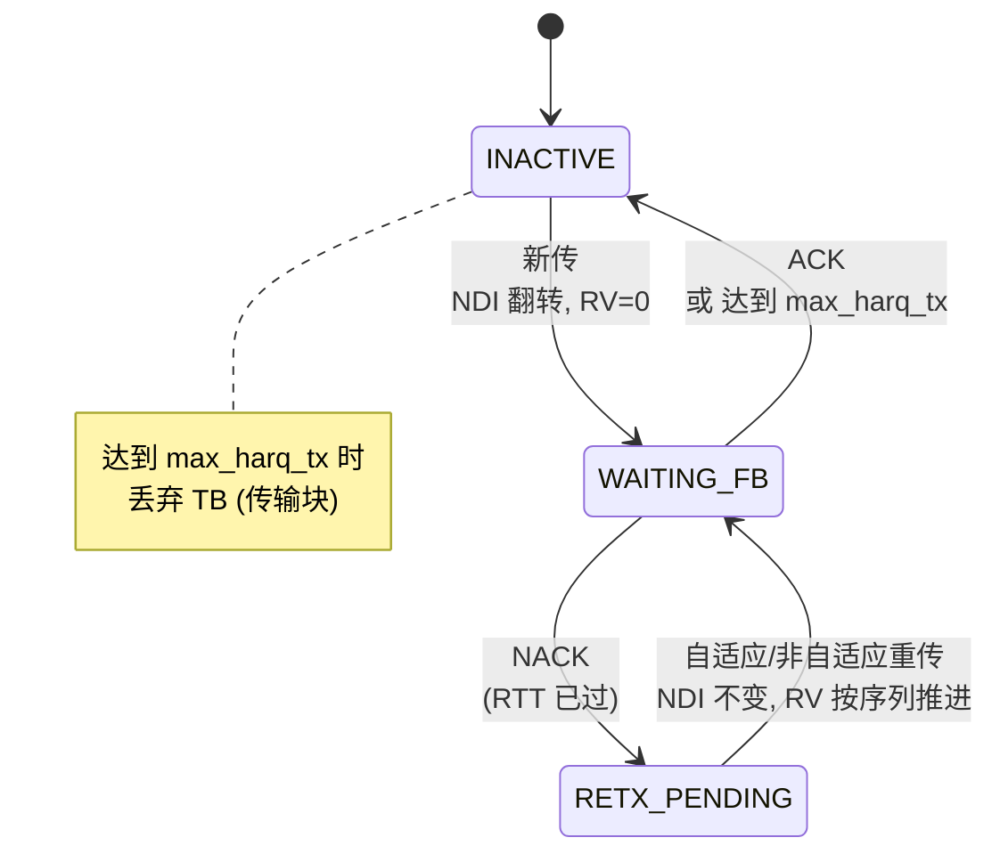
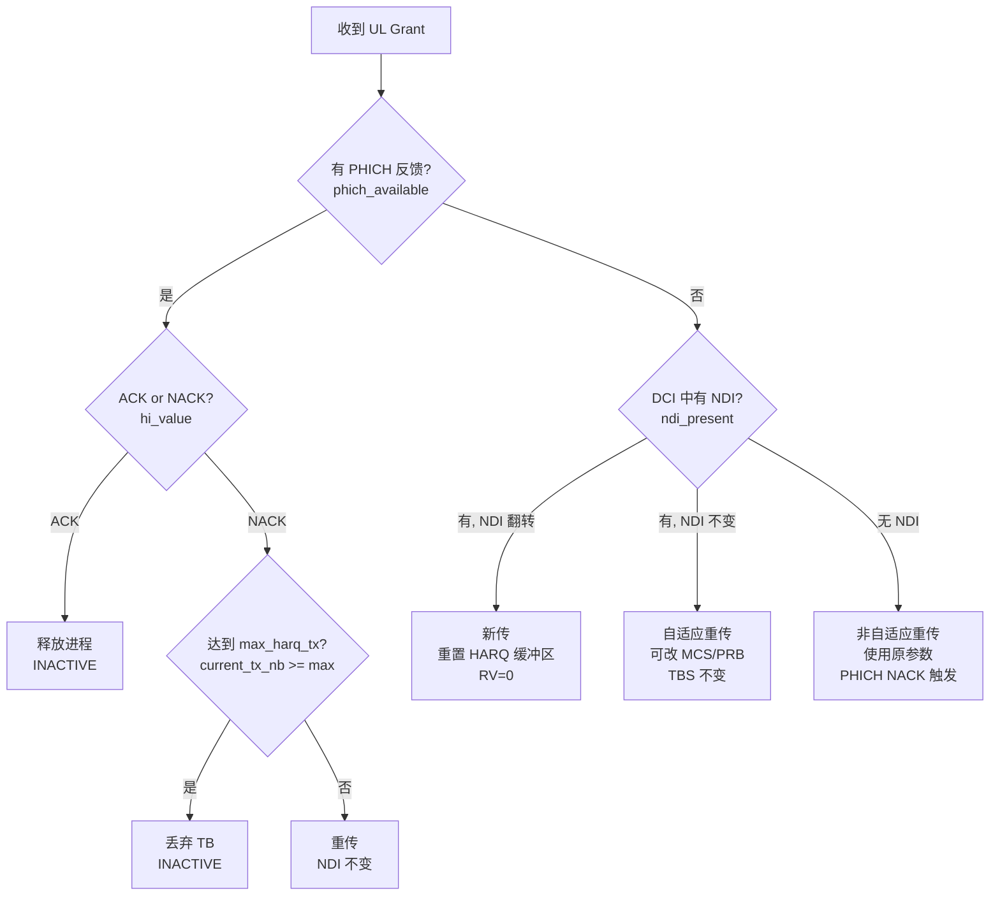
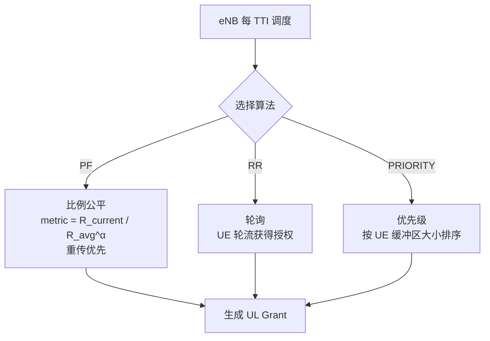
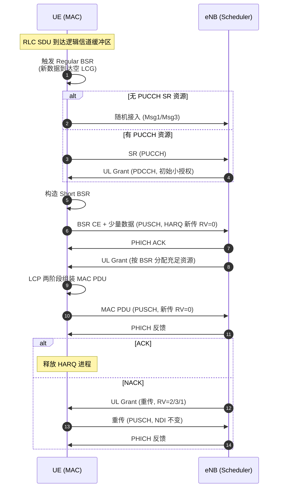

# UL MAC 层通信协议知识整理

> 基于 3GPP TS 36.321 (LTE MAC) / TS 38.321 (NR MAC) 协议规范
> 结合本项目 `ul_mac_manager` 的具体实现进行梳理
> 所有状态机/决策流程图均对应项目源码中的实际逻辑

---

## 目录

1. [MAC 层定位与协议栈](#1-mac-层定位与协议栈)
2. [关键常量与参数](#2-关键常量与参数)
3. [SR 调度请求 (§5.4.4)](#3-sr-调度请求-544)
4. [BSR 缓冲区状态报告 (§5.4.5)](#4-bsr-缓冲区状态报告-545)
5. [UL HARQ 重传 (§5.4.2)](#5-ul-harq-重传-542)
6. [LCP 逻辑信道优先级 (§5.4.3.1)](#6-lcp-逻辑信道优先级-5431)
7. [UL Scheduler 上行调度器](#7-ul-scheduler-上行调度器)
8. [端到端上行流程](#8-端到端上行流程)
9. [项目与协议对应关系](#9-项目与协议对应关系)

---

## 1. MAC 层定位与协议栈

### 1.1 协议栈位置

```
┌─────────────────────────────────┐
│  RRC (控制面) / NAS              │
├─────────────────────────────────┤
│  PDCP (头压缩/加密)              │
├─────────────────────────────────┤
│  RLC (分段/重传/ARQ)             │
├─────────────────────────────────┤
│  MAC ← 本项目关注层              │
│    • 逻辑信道 ↔ 传输信道映射      │
│    • 调度请求 SR                  │
│    • 缓冲区状态报告 BSR           │
│    • HARQ 重传                    │
│    • 逻辑信道优先级 LCP           │
├─────────────────────────────────┤
│  PHY (物理层, 调制/编码/发射)     │
└─────────────────────────────────┘
```

### 1.2 本项目范围

本项目聚焦 **UE 侧上行 MAC 用户管理**，参考 srsRAN_4G (LTE) 与 ocudu (NR) 实现。**未实现**的部分（数据面）：
- 完整 MAC PDU 组装（Header + CE + SDU 复用）
- 下行 HARQ / 下行调度
- PHY 实际交互（PHICH 资源映射、PUSCH 发射）

发送动作用回调抽象解耦（如 [ue_bsr_manager.h:57](include/ul_mac/ue_bsr_manager.h#L57) 的 `bsr_tx_callback`），实现简化为日志。

---

## 2. 关键常量与参数

来源：[common_types.h](include/ul_mac/common_types.h)

| 常量 | 值 | 协议含义 |
|------|-----|---------|
| `MAX_HARQ_PROCESSES` | 16 | HARQ 进程数上限（LTE 8 / NR 16，取 NR 上限） |
| `NOF_LCGS` | 4 | 逻辑信道组数量（3GPP 固定 4 个） |
| `MAX_LCID` | 32 | 最大逻辑信道 ID |
| `MAX_SR_TRANSMISSIONS` | 64 | SR 最大传输次数（dsr-TransMax 上限） |
| `MAX_HARQ_RETX` | 4 | HARQ 最大重传次数 |
| `TTI_DURATION_MS` | 1 | 子帧时长（LTE 1ms） |
| `BSR_BUFFER_SIZE_LEVELS` | 64 | BSR 缓冲区索引级数（6-bit） |
| `DEFAULT_PERIODIC_BSR_TIMER` | 80 ms | 周期 BSR 定时器默认值 |
| `DEFAULT_RETX_BSR_TIMER` | 320 ms | 重传 BSR 定时器默认值 |
| `DEFAULT_SR_PROHIBIT_TIMER` | 0 ms | SR 禁止定时器默认值（0=不禁止） |

### 2.1 默认配置（[common_types.h:109-121](include/ul_mac/common_types.h#L109-L121)）

```cpp
sr_config:
  enabled            = true
  dsr_transmax       = 8        // 最多发 8 次 SR
  sr_period          = 10 ms    // 每 10 TTI 可发一次
  sr_prohibit_timer  = 0        // 不禁止

ul_harq_config:
  max_harq_tx        = 4        // 新传+重传最多 4 次
  max_harq_msg3_tx   = 4        // Msg3 最多 4 次
  harq_rtt_ttis      = 8        // RTT = 8 TTI (LTE FDD)
```

---

## 3. SR 调度请求 (§5.4.4)

**协议参考**：TS 36.321 §5.4.4 / TS 38.321 §5.4.4
**项目实现**：[ue_sr_manager.h](include/ul_mac/ue_sr_manager.h) / [ue_sr_manager.cpp](src/ue_sr_manager.cpp)

### 3.1 触发条件

当 **Regular BSR 被触发** 且 UE **无上行授权** 时，触发 SR 过程（[ue_sr_manager.cpp](src/ue_sr_manager.cpp) `start()`）。若 PUCCH 未配置，则直接回退到随机接入 (RA)。

### 3.2 SR 状态机

状态定义见 [common_types.h:124-129](include/ul_mac/common_types.h#L124-L129)：`IDLE / PENDING / TRANSMITTING / FAILED`。



**对应源码方法**：
- `start()` — BSR 触发 SR，IDLE → PENDING
- `step(tti)` — 每 TTI 调用，检查周期、发送 SR，PENDING → TRANSMITTING
- `notify_ul_grant_received()` — 收到授权，回到 IDLE
- `fail_callback_` — 达到 `dsr_transmax` 触发失败回调

### 3.3 dsr-TransMax 与 RA 回退

`dsr_transmax` 限制 SR 最大发送次数（[sr_config](include/ul_mac/common_types.h#L109-L121) 默认 8）。超限后：
1. MAC 层通知 RRC SR 失败
2. RRC 释放该 UE 的 PUCCH SR 资源和 SRS 资源
3. 触发随机接入 (RA)，通过 Msg1/Msg3 重新请求资源
4. RA 过程的 Msg3 携带 BSR，eNB 通过 Msg4 中的 UL Grant 响应

### 3.4 项目增强：自适应 SR 周期

[ue_sr_manager.h:91-94](include/ul_mac/ue_sr_manager.h#L91-L94) `adjust_sr_period(traffic_rate)`：

```
ema_rate  = α * current_rate + (1-α) * old_rate        // 指数移动平均
new_period = clamp(K / log2(1 + ema_rate), 5, 80)      // 对数连续映射
// 迟滞机制：仅当 |new_period - current| / current > 20% 才调整
```

**物理意义**：高流量 → 短周期（低延迟）；低流量 → 长周期（省 PUCCH 资源）。对数映射避免离散跳变，迟滞避免阈值附近抖动。

---

## 4. BSR 缓冲区状态报告 (§5.4.5)

**协议参考**：TS 36.321 §5.4.5 / TS 38.321 §5.4.5
**项目实现**：[ue_bsr_manager.h](include/ul_mac/ue_bsr_manager.h) / [ue_bsr_manager.cpp](src/ue_bsr_manager.cpp)

### 4.1 三种触发类型

定义见 [common_types.h:78-83](include/ul_mac/common_types.h#L78-L83)。

| 类型 | 触发条件 | 是否触发 SR | 优先级 |
|------|---------|------------|--------|
| **Regular** | (1) 新数据到达空 LCG；(2) 高优先级数据到达（高于当前缓冲区） | ✅ 是（若无授权） | 最高 |
| **Periodic** | `periodicBSR-Timer` 超时（默认 80ms） | ❌ 否 | 中 |
| **Padding** | UL Grant 剩余空间足以填充 BSR CE | ❌ 否 | 最低 |

**同一 TTI 只发一个 BSR**，优先级：Regular > Periodic > Padding。

### 4.2 BSR 格式选择决策

格式定义见 [common_types.h:70-74](include/ul_mac/common_types.h#L70-L74)。决策逻辑见 [ue_bsr_manager.cpp](src/ue_bsr_manager.cpp) `select_bsr_format()` 与 `generate_bsr()`。



### 4.3 6-bit 缓冲区量化映射

[common_types.h:333-348](include/ul_mac/common_types.h#L333-L348) `bsr_index_to_bytes()`：

- 6-bit 索引 0~63 对应字节数 0~25000
- **对数尺度**：小缓冲区精度高（Index 10 → 52 bytes），大缓冲区精度低（Index 62 → 21956 bytes）
- 量化公式（3GPP 标准）：`BS[i] = ceil(BS[i-1] × 1.12)`
- 反向映射 `bytes_to_bsr_index()` 采用线性查找（项目简化）

### 4.4 BSR 定时器

[ue_bsr_manager.h:189-193](include/ul_mac/ue_bsr_manager.h#L189-L193)：

| 定时器 | 默认值 | 作用 |
|--------|--------|------|
| `periodicBSR-Timer` | 80 ms | 超时触发 Periodic BSR，确保 eNB 有最新缓冲区信息 |
| `retxBSR-Timer` | 320 ms | Regular BSR 发送后启动，超时且仍有数据则重发 Regular BSR |

### 4.5 项目增强

#### 4.5.1 预测性 BSR

[ue_bsr_manager.h:117-119](include/ul_mac/ue_bsr_manager.h#L117-L119) `predict_buffer_demand()`：

- 保留最近 10 个 TTI 的缓冲区历史（[ue_bsr_manager.h:204](include/ul_mac/ue_bsr_manager.h#L204) `buffer_history_`）
- 使用最小二乘线性回归预测未来缓冲区需求
- 帮助调度器提前规划资源，减少调度延迟

#### 4.5.2 差分 BSR

[ue_bsr_manager.h:139-151](include/ul_mac/ue_bsr_manager.h#L139-L151) `set_differential_enabled()`：

- **仅在 Padding BSR 场景生效**（Regular/Periodic 标准要求必须发送）
- 比较当前各 LCG 的 BSR 索引与上次报告值（[ue_bsr_manager.h:211](include/ul_mac/ue_bsr_manager.h#L211) `last_reported_bsr_`）
- 若全部未变化则跳过本次 Padding BSR，减少空口信令开销

---

## 5. UL HARQ 重传 (§5.4.2)

**协议参考**：TS 36.321 §5.4.2 / TS 38.321 §5.4.2
**项目实现**：[ue_ul_harq_manager.h](include/ul_mac/ue_ul_harq_manager.h) / [ue_ul_harq_manager.cpp](src/ue_ul_harq_manager.cpp)

### 5.1 LTE 上行 HARQ 特性

- **同步 HARQ**：进程 ID 由子帧号隐式确定（固定时序）
- **RTT = 8 TTI**（FDD），一个进程发送后需等 8ms 才能收到 PHICH 反馈
- **多进程并行**：LTE 8 个 / NR 最多 16 个（[common_types.h:35](include/ul_mac/common_types.h#L35) `MAX_HARQ_PROCESSES = 16`）

### 5.2 HARQ 进程状态机

状态定义见 [common_types.h:136-140](include/ul_mac/common_types.h#L136-L140)：`INACTIVE / WAITING_FB / RETX_PENDING`。



**对应源码**：[ue_ul_harq_manager.cpp](src/ue_ul_harq_manager.cpp) `ul_harq_process::new_grant_ul()` 与 `generate_new_tx()` / `generate_retx()`。

### 5.3 new_grant_ul 决策流程

[ue_ul_harq_manager.h:83-84](include/ul_mac/ue_ul_harq_manager.h#L83-L84) `new_grant_ul()` 是 HARQ 核心决策入口，对应 srsRAN `ul_harq.cc` 同名方法。



### 5.4 NDI 翻转判断新传/重传

- **NDI 翻转**（与上次不同）→ 新传输：重置 HARQ 缓冲区，RV=0
- **NDI 未翻转**（与上次相同）→ 重传：使用原缓冲区数据
- **特殊情况**：
  - 首次收到 Grant（无历史 NDI）→ 视为新传
  - RAR 中的 Grant（[ul_grant.is_rar](include/ul_mac/common_types.h#L170)）→ 始终为新传（Msg3）
  - TC-RNTI 场景（`is_temp_rnti`）→ Msg3 传输特殊处理

### 5.5 RV 冗余版本序列 {0, 2, 3, 1}

[common_types.h:361-369](include/ul_mac/common_types.h#L361-L369) `rv_of_irv()`：

```cpp
static const uint32_t rv_table[4] = {0, 2, 3, 1};
return rv_table[irv % 4];   // irv 每次传输后递增
```

**为什么是 {0, 2, 3, 1} 而非 {0, 1, 2, 3}？**

与 Turbo 码 / LDPC 码的编码特性有关：
- RV=0：包含最多系统比特（信息位），自解码能力最强
- RV=2：包含最多校验比特 A
- RV=3：包含最多校验比特 B
- RV=1：混合类型

序列 `{0, 2, 3, 1}` 使前两次传输（RV=0 + RV=2）就包含足够系统+校验信息，实现最佳增量冗余（IR）效果。若用 `{0, 1, 2, 3}`，第二次传输 RV=1 自解码能力弱，浪费一次传输机会。

### 5.6 自适应 vs 非自适应重传

| 特性 | 自适应重传 | 非自适应重传 |
|------|-----------|-------------|
| 触发方式 | eNB 发新 DCI（含 NDI） | PHICH NACK |
| MCS/PRB | 可改变 | 使用原参数 |
| TBS | **不变**（保证 HARQ 软合并） | 不变 |
| 项目字段 | `ndi_present=true` | `ndi_present=false`, `phich_available=true` |

### 5.7 RTT 延迟建模

[ue_ul_harq_manager.h:109-119](include/ul_mac/ue_ul_harq_manager.h#L109-L119)：

- `tx_tti_` 记录本次传输的 TTI
- `rtt_ttis_` = 8（LTE FDD 标准）
- `is_feedback_ready(current_tti)`：`current_tti - tx_tti_ >= rtt_ttis_` 时反馈才可用
- `feedback_pending_`：标记反馈在途中，避免提前处理
- 设 `rtt_ttis_=0` 可退化为即时反馈（用于测试）

### 5.8 项目增强：早期终止

[ue_ul_harq_manager.h:121-141](include/ul_mac/ue_ul_harq_manager.h#L121-L141)：

- `consecutive_nack_` 连续 NACK 计数（ACK 时清零）
- 当连续 NACK ≥ 3 且已重传 ≥ 2 次时提前丢弃 TB
- 避免在恶劣信道条件下浪费无线资源
- `early_termination_enabled_` 默认启用，可关闭

---

## 6. LCP 逻辑信道优先级 (§5.4.3.1)

**协议参考**：TS 36.321 §5.4.3.1
**项目实现**：[lcg_buffer.h](include/ul_mac/lcg_buffer.h) 中的令牌桶逻辑

### 6.1 两阶段调度


### 6.2 令牌桶机制

[common_types.h:227-233](include/ul_mac/common_types.h#L227-L233)：

| 参数 | 含义 |
|------|------|
| `pbr` (Prioritized Bit Rate) | 优先级比特率 (bytes/ms)，0 = 无限制（∞） |
| `bsd` (Bucket Size Duration) | 桶大小持续时间 (ms) |
| `token_bucket_size` | 桶容量 = `pbr * bsd` (bytes) |
| `token_count` | 当前令牌数，随时间补充，取数据时扣减 |

**作用**：PBR 限制每个逻辑信道在第一阶段可获取的资源，**防止低优先级信道饿死高优先级信道**（例如 VoIP 优先级高但速率低，不被大文件传输抢占）。

---

## 7. UL Scheduler 上行调度器

**项目实现**：[enb_ul_scheduler.h](include/ul_mac/enb_ul_scheduler.h) / [enb_ul_scheduler.cpp](src/enb_ul_scheduler.cpp)

### 7.1 三种调度算法



### 7.2 PF 比例公平算法

- **度量值**：`PF = R_current(t) / R_avg(t)^α`
- `R_current`：当前 UE 可支持速率（由 SNR 决定）
- `R_avg`：历史平均速率，EMA 更新 `R_avg = (1-α)*R_avg + α*R_current`
- **重传优先于新传**（保证 HARQ RTT，见 [README.md:506-508](README.md#L506-L508)）
- 优点：吞吐率与公平性平衡；缺点：计算复杂度高，需维护每 UE 历史状态

### 7.3 UL Grant 生成

1. **MCS 计算**：UE 上报 SNR (0~30dB) → MCS (0~28)，使用 29 个阈值点的区间映射表
2. **PRB 计算**：`required_prb = ceil(req_bytes / bytes_per_prb)`
3. **TBS 计算**：基于 TS 36.213 Table 7.1.7.2.1-1 简化查找表（6 个锚点 + 线性插值）

---

## 8. 端到端上行流程



---

## 9. 项目与协议对应关系

| 功能模块 | 协议章节 | 项目实现 | srsRAN 原型 | 符合度 |
|---------|---------|---------|------------|--------|
| SR 状态机 | TS 36.321 §5.4.4 | [ue_sr_manager](include/ul_mac/ue_sr_manager.h) | `srsue::mac::sr_proc` | 高 |
| BSR 触发 | TS 36.321 §5.4.5 | [ue_bsr_manager](include/ul_mac/ue_bsr_manager.h) | `srsue::mac::bsr_proc` | 高 |
| BSR 格式 | TS 36.321 §6.1.3 | `select_bsr_format()` | `proc_bsr.cc` | 高 |
| HARQ NDI | TS 36.321 §5.4.2.1 | `new_grant_ul()` | `ul_harq.cc` | 高 |
| RV 序列 | TS 36.212 §5.2.2 | [rv_of_irv()](include/ul_mac/common_types.h#L366) | `rv_of_irv` | 高 |
| LCP 令牌桶 | TS 36.321 §5.4.3.1 | [lcg_buffer](include/ul_mac/lcg_buffer.h) | `bsr_proc::lcg_buffer_state` | 高 |
| PF 调度 | 业界通用 | [enb_ul_scheduler](include/ul_mac/enb_ul_scheduler.h) | `srsenb::mac::sched` | 中 |
| MCS/TBS | TS 36.213 §7.1.7 | `enb_ul_scheduler.cpp` | — | 高 |
| PHICH | TS 36.213 §8.0 | 概率 BLER 模型 | — | 中 |

### 9.1 项目简化说明

- 未实现完整 MAC PDU 构造（Header + CE + SDU 复用）
- 未实现下行 HARQ 和下行调度
- 信道模型简化为概率 BLER
- 发送动作（`bsr_tx_callback` 等）简化为日志，保留回调抽象骨架

### 9.2 项目增强功能（非协议要求）

| 增强功能 | 位置 | 价值 |
|---------|------|------|
| 自适应 SR 周期 | [ue_sr_manager.h:91](include/ul_mac/ue_sr_manager.h#L91) | 高流量低延迟，低流量省资源 |
| 预测性 BSR | [ue_bsr_manager.h:117](include/ul_mac/ue_bsr_manager.h#L117) | 线性回归预测，调度器提前规划 |
| 差分 BSR | [ue_bsr_manager.h:139](include/ul_mac/ue_bsr_manager.h#L139) | Padding BSR 跳过未变化项，省信令 |
| HARQ 早期终止 | [ue_ul_harq_manager.h:121](include/ul_mac/ue_ul_harq_manager.h#L121) | 恶劣信道下提前丢弃，省资源 |
| HARQ RTT 建模 | [ue_ul_harq_manager.h:109](include/ul_mac/ue_ul_harq_manager.h#L109) | 真实模拟 PHICH 反馈时序 |

---

## 参考资料

- 3GPP TS 36.321 (LTE MAC)
- 3GPP TS 38.321 (NR MAC)
- 3GPP TS 36.213 (LTE PHY)
- srsRAN 开源项目: https://github.com/srsran/srsRAN
- 项目主文档: [README.md](README.md)
- 学习路径: [LEARNING_PATH.md](LEARNING_PATH.md)
