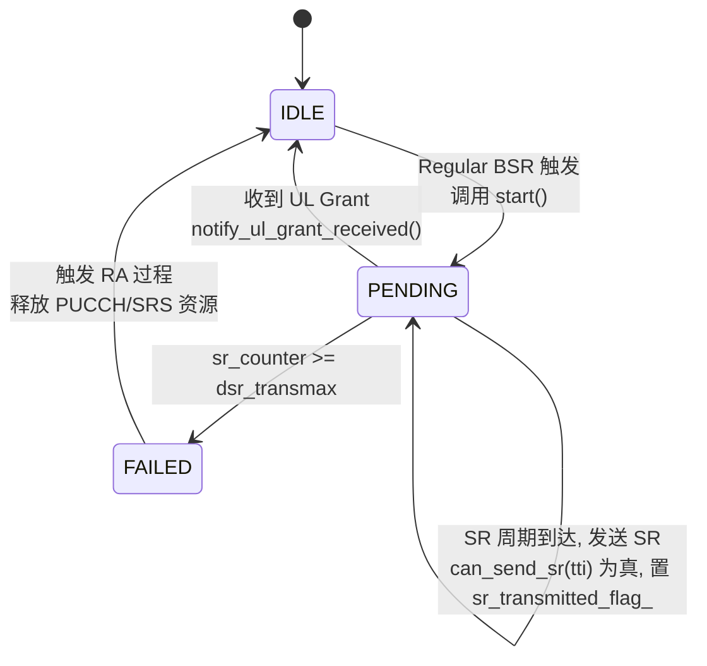
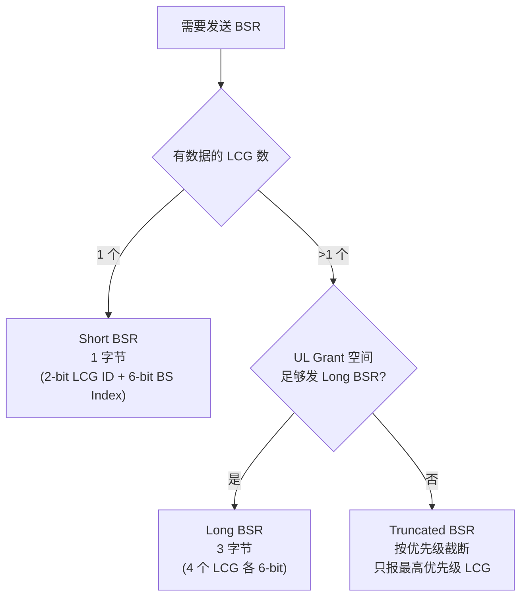
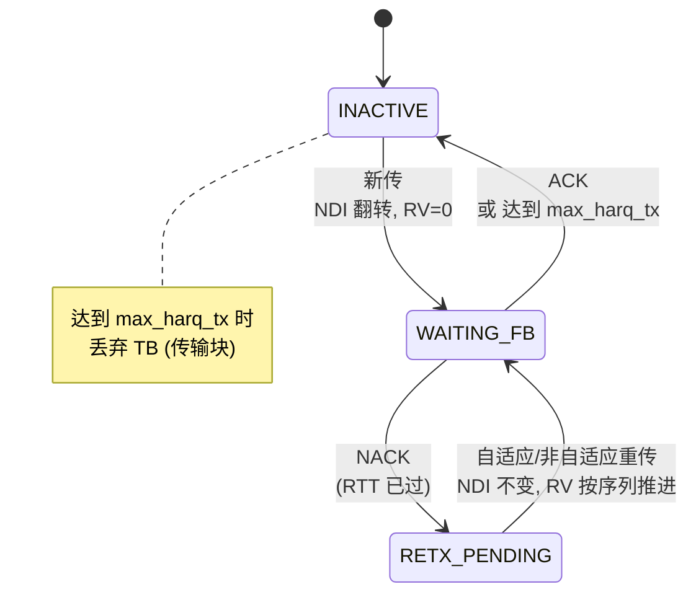
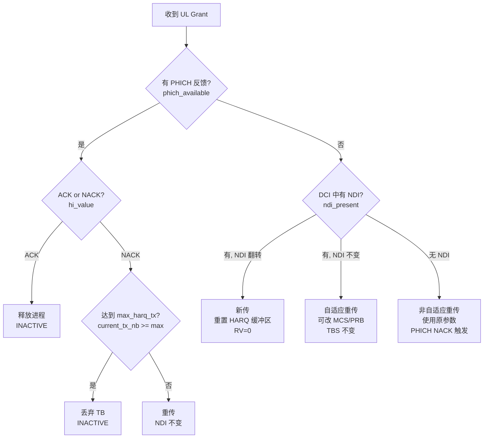
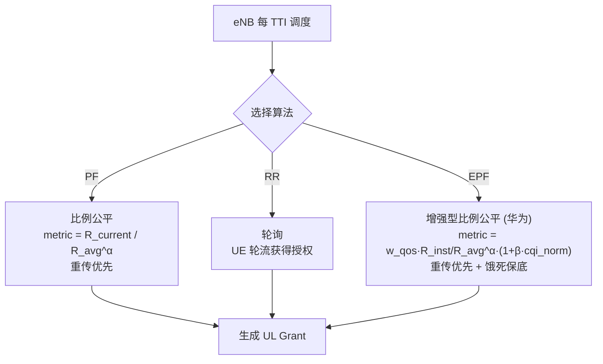
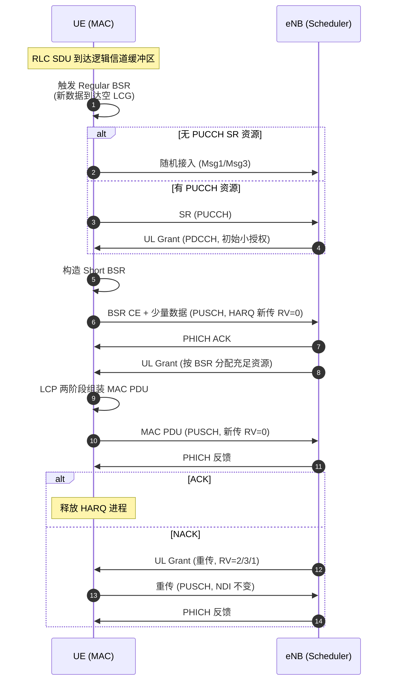

# UL MAC 层通信协议知识整理（eNB 基站侧上行调度视角）

> 基于 3GPP TS 36.321 (LTE MAC) / TS 38.321 (NR MAC) 协议规范
> 结合本项目 `ul_mac_manager` 的具体实现进行梳理
> **文档重心**：本项目以 **eNB/gNB 基站侧上行调度** 为学习和实现重点；UE 侧（ue_context / ue_*_manager）仅为**仿真桩**，用于驱动 eNB 调度器、模拟对端行为
> 所有状态机/决策流程图均对应项目源码中的实际逻辑

---

## 目录

1. [MAC 层定位与协议栈（eNB 视角）](#1-mac-层定位与协议栈)
2. [关键常量与参数](#2-关键常量与参数)
3. [SR 调度请求 (§5.4.4)](#3-sr-调度请求-544)
4. [BSR 缓冲区状态报告 (§5.4.5)](#4-bsr-缓冲区状态报告-545)
5. [UL HARQ 重传 (§5.4.2)](#5-ul-harq-重传-542)
6. [LCP 逻辑信道优先级 (§5.4.3.1)](#6-lcp-逻辑信道优先级-5431)
7. [UL Scheduler 上行调度器（本项目核心模块）](#7-ul-scheduler-上行调度器本项目核心模块)
8. [端到端上行流程（eNB 主视角）](#8-端到端上行流程)
9. [项目与协议对应关系](#9-项目与协议对应关系)
10. [P0/P1 修复与 P2 待办](#10-p0p1-修复与-p2-待办)

---

## 1. MAC 层定位与协议栈

### 1.1 协议栈位置（本项目关注 eNB MAC）

```
┌─────────────────────────────────┐
│  RRC (控制面) / NAS              │
├─────────────────────────────────┤
│  PDCP (头压缩/加密)              │
├─────────────────────────────────┤
│  RLC (分段/重传/ARQ)             │
├─────────────────────────────────┤
│  MAC                            │
│   ┌───────────────────────────┐ │
│   │ eNB 侧 (本项目重心)       │ │  ← 调度器在此: 收 SR/BSR/CQI/PHR/CRC
│   │  • 上行资源调度 (UL Grant) │ │     决策 MCS/PRB/TBS、生成授权、管 HARQ
│   │  • 调度请求 SR 接收        │ │
│   │  • 缓冲区状态 BSR 解码     │ │
│   │  • HARQ 重传调度           │ │
│   │  • 逻辑信道优先级 LCP      │ │
│   └───────────────────────────┘ │
│   ┌───────────────────────────┐ │
│   │ UE 侧 (本项目为仿真桩)    │ │  ← 仅模拟对端: 产生数据/发 SR/编 BSR
│   │  • 触发 SR / 编码 BSR      │ │     供 eNB 调度器消费, 不参与决策
│   │  • HARQ 软缓冲 / NDI 判断  │ │
│   └───────────────────────────┘ │
├─────────────────────────────────┤
│  PHY (物理层, 调制/编码/发射)     │
└─────────────────────────────────┘
```

> **学习重心提示**：基站平台组的真实工作中，你面对的就是 eNB MAC 调度器这一侧——接收 UE 上报、做调度决策、下发授权、处理 HARQ 反馈。UE 侧代码在本项目里只用来"喂数据"，理解其**上报语义**即可，不必深究其实现细节。

### 1.2 本项目范围

本项目聚焦 **eNB 基站侧上行 MAC 调度**，参考 srsRAN_4G `srsenb` (LTE) 与 ocudu scheduler (NR) 实现。

**eNB 侧核心模块（重点学习）**：
- [enb_ul_scheduler](include/ul_mac/enb_ul_scheduler.h)：上行调度器——接收 SR/BSR/CQI/PHR/CRC，运行 PF/RR/EPF 三种算法，生成 UL Grant，管理 HARQ 进程
- [enb_bsr_manager](include/ul_mac/enb_bsr_manager.h)：eNB 侧 BSR 解码器——把 UE 上报的 BSR CE 解码为 per-UE LCG 缓冲区视图
- [enb_ul_harq_manager](include/ul_mac/enb_ul_harq_manager.h)：eNB 侧 HARQ 软合并/重传决策——维护 per-UE 软缓冲与 NDI，输出 CRC 解码成败

**UE 侧仿真桩（理解对端即可）**：
- [ue_context](include/ul_mac/ue_context.h) / [ue_sr_manager](include/ul_mac/ue_sr_manager.h) / [ue_bsr_manager](include/ul_mac/ue_bsr_manager.h) / [ue_ul_harq_manager](include/ul_mac/ue_ul_harq_manager.h)：模拟 UE 行为，产生数据、编码 BSR、执行 HARQ 软缓冲，通过 `main.cpp` 的函数调用直接把报告"空口"投递给 eNB 调度器。**这些模块不掌握调度决策权**，仅用于让 eNB 调度器在闭环中跑起来。

**未实现**的部分：
- 下行 HARQ / 下行调度
- PHY 实际交互（PHICH 资源映射、PUSCH 发射）
- UE 侧真实协议栈（RLC/PDCP 集成）

> 注：上行 **MAC PDU 组包/解包** 已在 P1 阶段实现（[mac_pdu.h](include/ul_mac/mac_pdu.h) / [mac_pdu.cpp](src/mac_pdu.cpp)，对应 TS 36.321 §6.1.2）——用于 eNB 侧把调度结果落地为字节流、并解包 UE 上报的 PDU 校验。详见 §7.2.3 与 §9。

---

## 2. 关键常量与参数

来源：[common_types.h](include/ul_mac/common_types.h)

| 常量 | 值 | 协议含义 |
|------|-----|---------|
| `MAX_HARQ_PROCESSES` | 8 | HARQ 进程数上限（LTE 4G 上行固定为 8，流水线填满 8ms HARQ RTT） |
| `NOF_LCGS` | 4 | 逻辑信道组数量（3GPP 固定 4 个） |
| `MAX_LCID` | 32 | 最大逻辑信道 ID |
| `MAX_SR_TRANSMISSIONS` | 64 | SR 最大传输次数（dsr-TransMax 上限） |
| `MAX_HARQ_RETX` | 4 | HARQ 最大重传次数 |
| `TTI_DURATION_MS` | 1 | 子帧时长（LTE 1ms） |
| `BSR_BUFFER_SIZE_LEVELS` | 64 | BSR 缓冲区索引级数（6-bit） |
| `DEFAULT_PERIODIC_BSR_TIMER` | 80 ms | 周期 BSR 定时器默认值 |
| `DEFAULT_RETX_BSR_TIMER` | 320 ms | 重传 BSR 定时器默认值 |
| `DEFAULT_SR_PROHIBIT_TIMER` | 0 ms | SR 禁止定时器默认值（0=不禁止） |

### 2.1 默认配置（[common_types.h:109-121](include/ul_mac/common_types.h#L109-L121)）

```cpp
sr_config:
  enabled            = true
  dsr_transmax       = 8        // 最多发 8 次 SR
  sr_period          = 10 ms    // 每 10 TTI 可发一次
  sr_prohibit_timer  = 0        // 不禁止

ul_harq_config:
  max_harq_tx        = 4        // 新传+重传最多 4 次
  max_harq_msg3_tx   = 4        // Msg3 最多 4 次
  harq_rtt_ttis      = 8        // RTT = 8 TTI (LTE FDD)
```

---

## 3. SR 调度请求 (§5.4.4)

**协议参考**：TS 36.321 §5.4.4 / TS 38.321 §5.4.4

> **本协议主线在 eNB 侧**：SR 最终由 eNB 调度器在 `ul_scheduler::handle_sr()` 接收、在 `schedule_ul()` 中决策授权。UE 侧 `ue_sr_manager` 只是产生 SR 信号的**仿真桩**，理解其"上报"语义即可。
> - **eNB 侧（重点）**：[enb_ul_scheduler.h](include/ul_mac/enb_ul_scheduler.h) `handle_sr()` / `schedule_ul()`
> - **UE 侧（桩）**：[ue_sr_manager.h](include/ul_mac/ue_sr_manager.h) / [ue_sr_manager.cpp](src/ue_sr_manager.cpp)

### 3.1 触发条件（UE 桩视角）

当 **Regular BSR 被触发** 且 UE **无上行授权** 时，触发 SR 过程（[ue_sr_manager.cpp](src/ue_sr_manager.cpp) `start()`）。若 PUCCH 未配置，则直接回退到随机接入 (RA)。

### 3.1b eNB 侧处理（重点）：handle_sr → 调度决策

```cpp
// 文件: src/enb_ul_scheduler.cpp  (eNB 调度器)
void ul_scheduler::handle_sr(uint16_t rnti) {
    std::lock_guard<std::mutex> lock(mutex_);
    auto it = ue_db_.find(rnti);
    if (it == ue_db_.end()) return;
    ue_sched_context& ctx = it->second;
    // SR 冷却: 4ms 内已调度过则不重复触发(避免 SR 风暴)
    if (ctx.last_scheduled_tti != UINT32_MAX &&
        (tti - ctx.last_scheduled_tti) < 4) return;
    ctx.sr_pending = true;   // 置位, 供 schedule_ul() 在排序时优先
}
```
- eNB 收到 SR 仅置 `sr_pending` 标志，**不立即分配资源**；真正授权在 `schedule_ul()` 按算法统一分配
- `sr_pending` 在调度排序中享有最高优先级（见 §7 schedule_pf 阶段1）

### 3.2 SR 状态机

状态定义见 [common_types.h:140-144](include/ul_mac/common_types.h#L140-L144)：`IDLE / PENDING / FAILED`。

> 注：`TRANSMITTING` 瞬态已删除（common_types.h:138-139）。旧实现在同一临界区内置位 `TRANSMITTING` 后立即回 `PENDING`，外部永远观察不到，属冗余状态。发送 SR 后保持 `PENDING` 按周期重发，直到收到 Grant。



**对应源码方法**：
- `start()` — BSR 触发 SR，IDLE → PENDING
- `step(tti)` — 每 TTI 调用，周期到达且未超限时发送 SR；发送后保持 PENDING（经 `sr_transmitted_flag_` 通知外部），收到 Grant 才回 IDLE
- `notify_ul_grant_received()` — 收到授权，回到 IDLE
- `fail_callback_` — 达到 `dsr_transmax` 触发失败回调

### 3.3 dsr-TransMax 与 RA 回退

`dsr_transmax` 限制 SR 最大发送次数（[sr_config](include/ul_mac/common_types.h#L109-L121) 默认 8）。超限后：
1. MAC 层通知 RRC SR 失败
2. RRC 释放该 UE 的 PUCCH SR 资源和 SRS 资源
3. 触发随机接入 (RA)，通过 Msg1/Msg3 重新请求资源
4. RA 过程的 Msg3 携带 BSR，eNB 通过 Msg4 中的 UL Grant 响应

### 3.4 项目增强：自适应 SR 周期

[ue_sr_manager.h:91-94](include/ul_mac/ue_sr_manager.h#L91-L94) `adjust_sr_period(traffic_rate)`：

```
ema_rate  = α * current_rate + (1-α) * old_rate        // 指数移动平均
new_period = clamp(K / log2(1 + ema_rate), 5, 80)      // 对数连续映射
// 迟滞机制：仅当 |new_period - current| / current > 20% 才调整
```

**物理意义**：高流量 → 短周期（低延迟）；低流量 → 长周期（省 PUCCH 资源）。对数映射避免离散跳变，迟滞避免阈值附近抖动。

---

## 4. BSR 缓冲区状态报告 (§5.4.5)

**协议参考**：TS 36.321 §5.4.5 / TS 38.321 §5.4.5

> **本协议主线在 eNB 侧**：eNB 通过 `enb_bsr_manager::receive_bsr()` 把 UE 上报的 BSR CE 解码成 **per-UE LCG 缓冲区视图**，这是调度器做资源分配的输入。UE 侧 `ue_bsr_manager` 是**编码桩**。
> - **eNB 侧（重点）**：[enb_bsr_manager.h](include/ul_mac/enb_bsr_manager.h) `receive_bsr()` → 维护 `ue_db_[rnti].lcg_buffer[]`
> - **UE 侧（桩）**：[ue_bsr_manager.h](include/ul_mac/ue_bsr_manager.h) / [ue_bsr_manager.cpp](src/ue_bsr_manager.cpp) 编码 BSR CE

### 4.1 三种触发类型（UE 桩视角）

定义见 [common_types.h:78-83](include/ul_mac/common_types.h#L78-L83)。

| 类型 | 触发条件 | 是否触发 SR | 优先级 |
|------|---------|------------|--------|
| **Regular** | (1) 新数据到达空 LCG；(2) 高优先级数据到达（高于当前缓冲区） | ✅ 是（若无授权） | 最高 |
| **Periodic** | `periodicBSR-Timer` 超时（默认 80ms） | ❌ 否 | 中 |
| **Padding** | UL Grant 剩余空间足以填充 BSR CE | ❌ 否 | 最低 |

**同一 TTI 只发一个 BSR**，优先级：Regular > Periodic > Padding。

### 4.2 BSR 格式选择决策

格式定义见 [common_types.h:70-74](include/ul_mac/common_types.h#L70-L74)。决策逻辑见 [ue_bsr_manager.cpp](src/ue_bsr_manager.cpp) `select_bsr_format()` 与 `generate_bsr()`。



### 4.3 6-bit 缓冲区量化映射

[common_types.h:333-348](include/ul_mac/common_types.h#L333-L348) `bsr_index_to_bytes()`：

- 6-bit 索引 0~63 对应字节数 0~25000（**本项目为演示用的简化表**，上限 25000 字节）
- **对数尺度**：小缓冲区精度高（Index 10 → 52 bytes），大缓冲区精度低（Index 62 → 21956 bytes）
- 3GPP 标准表（TS 36.321 Table 6.1.3.1-1）的量化公式为 `BS[i] = ceil(BS[i-1] × 1.12)`，索引 62 对应 150000 字节、索引 63 表示 ">150000"。项目简化表保持了相同的"对数递增"形状，但量纲上限更小——面试/阅读时需能区分"标准表"与"项目表"
- 反向映射 `bytes_to_bsr_index()` 采用向下取整语义（返回满足 `table[i] <= bytes` 的最大索引 i，对应 §5.4.5 的区间下界解读），线性查找实现

### 4.4 BSR 定时器

[ue_bsr_manager.h:189-193](include/ul_mac/ue_bsr_manager.h#L189-L193)：

| 定时器 | 默认值 | 作用 |
|--------|--------|------|
| `periodicBSR-Timer` | 80 ms | 超时触发 Periodic BSR，确保 eNB 有最新缓冲区信息 |
| `retxBSR-Timer` | 320 ms | Regular BSR 发送后启动，超时且仍有数据则重发 Regular BSR |

### 4.4b eNB 侧解码（重点）：receive_bsr → LCG 缓冲区视图

```cpp
// 文件: src/enb_bsr_manager.cpp  (eNB 侧)
bool enb_bsr_manager::receive_bsr(uint16_t rnti, const bsr_ce& bsr) {
    // ... 查 ue_db_, 校验 reports 非空 ...
    auto& view = ue_db_[rnti].lcg_buffer;
    // Short/Truncated: 只更新报告的 1 个 LCG, 不影响其它
    // Long: 先清零所有 LCG, 再填报告项 (UE 端只编码 buffer>0 的 LCG)
    if (bsr.format == bsr_format::LONG_BSR) view.fill(0);
    for (const auto& r : bsr.reports) {
        if (r.lcg_id >= NOF_LCGS) continue;
        // TS 36.321 §6.1.3.1: 索引对应区间下界, eNB 按 "缓冲区 >= table[i]" 解读
        view[r.lcg_id] = bsr_index_to_bytes(r.buffer_size);
    }
    // 更新统计: total_bsr_rx / short_count / truncated_count / long_count
}
```
- 解码结果 `ue_db_[rnti].lcg_buffer[]` 被 `ul_scheduler::handle_bsr()` → `ue_db_[rnti].ul_buffer[]` 取用，是调度器分配资源的依据
- 关键语义：**Short/Truncated BSR 只更新部分 LCG**（标准 §5.4.5 允许），eNB 视图中未报告的 LCG 保留旧值——这是标准行为，不是 bug

### 4.5 UE 桩增强（非 eNB 逻辑，仅了解）

> 以下增强位于 UE 侧 `ue_bsr_manager`，属于"对端更聪明地编码 BSR"的演示，**未接入 eNB 调度器决策**，仅作协议扩展认知，不必深究。

#### 4.5.1 Padding BSR 抑制（非 3GPP 标准，仅本项目开销优化）

[ue_bsr_manager.h:139-151](include/ul_mac/ue_bsr_manager.h#L139-L151) `set_differential_enabled()`（注：函数名保留 `differential` 仅为兼容，语义为 Padding BSR 抑制）：

- **仅在 Padding BSR 场景生效**（Regular/Periodic 标准要求必须发送）
- 比较当前各 LCG 的 BSR 索引与上次报告值（[ue_bsr_manager.h:211](include/ul_mac/ue_bsr_manager.h#L211) `last_reported_bsr_`）
- 若全部未变化则跳过本次 Padding BSR，减少空口信令开销

---

## 5. UL HARQ 重传 (§5.4.2)

**协议参考**：TS 36.321 §5.4.2 / TS 38.321 §5.4.2

> **本协议主线在 eNB 侧**：HARQ 重传决策由 eNB 调度器在 `ul_scheduler::handle_ul_crc()` 中完成（根据 CRC 结果翻转 NDI / 触发重传 / 释放进程）。eNB 侧 `enb_ul_harq_manager` 维护 per-UE 软合并缓冲与 NDI 跟踪；UE 侧 `ue_ul_harq_manager` 是**软缓冲桩**。
> - **eNB 侧（重点）**：[enb_ul_scheduler.h](include/ul_mac/enb_ul_scheduler.h) `handle_ul_crc()` / [enb_ul_harq_manager.h](include/ul_mac/enb_ul_harq_manager.h) `receive_tb()`
> - **UE 侧（桩）**：[ue_ul_harq_manager.h](include/ul_mac/ue_ul_harq_manager.h) / [ue_ul_harq_manager.cpp](src/ue_ul_harq_manager.cpp)

### 5.1 LTE 上行 HARQ 特性（协议背景）

- **同步 HARQ**：进程 ID 由子帧号隐式确定（固定时序）
- **RTT = 8 TTI**（FDD），一个进程发送后需等 8ms 才能收到 PHICH 反馈
- **多进程并行**：LTE 4G 上行固定 8 个（[common_types.h:37](include/ul_mac/common_types.h#L37) `MAX_HARQ_PROCESSES = 8`，已按 LTE 规范取值）

### 5.2 HARQ 进程状态机

状态定义见 [common_types.h:136-140](include/ul_mac/common_types.h#L136-L140)：`INACTIVE / WAITING_FB / RETX_PENDING`。



**对应源码**：[ue_ul_harq_manager.cpp](src/ue_ul_harq_manager.cpp) `ul_harq_process::new_grant_ul()` 与 `generate_new_tx()` / `generate_retx()`。

### 5.3 new_grant_ul 决策流程

[ue_ul_harq_manager.h:83-84](include/ul_mac/ue_ul_harq_manager.h#L83-L84) `new_grant_ul()` 是 HARQ 核心决策入口，对应 srsRAN `ul_harq.cc` 同名方法。



### 5.4 NDI 翻转判断新传/重传

- **NDI 翻转**（与上次不同）→ 新传输：重置 HARQ 缓冲区，RV=0
- **NDI 未翻转**（与上次相同）→ 重传：使用原缓冲区数据
- **特殊情况**：
  - 首次收到 Grant（无历史 NDI）→ 视为新传
  - RAR 中的 Grant（[ul_grant.is_rar](include/ul_mac/common_types.h#L170)）→ 始终为新传（Msg3）
  - TC-RNTI 场景（`is_temp_rnti`）→ Msg3 传输特殊处理

### 5.5 RV 冗余版本序列 {0, 2, 3, 1}

[common_types.h:361-369](include/ul_mac/common_types.h#L361-L369) `rv_of_irv()`：

```cpp
static const uint32_t rv_table[4] = {0, 2, 3, 1};
return rv_table[irv % 4];   // irv 每次传输后递增
```

**为什么是 {0, 2, 3, 1} 而非 {0, 1, 2, 3}？**

与 Turbo 码 / LDPC 码的编码特性有关：
- RV=0：包含最多系统比特（信息位），自解码能力最强
- RV=2：包含最多校验比特 A
- RV=3：包含最多校验比特 B
- RV=1：混合类型

序列 `{0, 2, 3, 1}` 使前两次传输（RV=0 + RV=2）就包含足够系统+校验信息，实现最佳增量冗余（IR）效果。若用 `{0, 1, 2, 3}`，第二次传输 RV=1 自解码能力弱，浪费一次传输机会。

### 5.6 自适应 vs 非自适应重传

| 特性 | 自适应重传 | 非自适应重传 |
|------|-----------|-------------|
| 触发方式 | eNB 发新 DCI（含 NDI） | PHICH NACK |
| MCS/PRB | 可改变 | 使用原参数 |
| TBS | **不变**（保证 HARQ 软合并） | 不变 |
| 项目字段 | `ndi_present=true` | `ndi_present=false`, `phich_available=true` |

### 5.7 RTT 延迟建模

[ue_ul_harq_manager.h:109-119](include/ul_mac/ue_ul_harq_manager.h#L109-L119)：

- `tx_tti_` 记录本次传输的 TTI
- `rtt_ttis_` = 8（LTE FDD 标准）
- `is_feedback_ready(current_tti)`：`current_tti - tx_tti_ >= rtt_ttis_` 时反馈才可用
- `feedback_pending_`：标记反馈在途中，避免提前处理
- 设 `rtt_ttis_=0` 可退化为即时反馈（用于测试）

### 5.8 项目增强：早期终止

[ue_ul_harq_manager.h:121-141](include/ul_mac/ue_ul_harq_manager.h#L121-L141)：

- `consecutive_nack_` 连续 NACK 计数（ACK 时清零）
- 当连续 NACK ≥ 3 且已重传 ≥ 2 次时提前丢弃 TB
- 避免在恶劣信道条件下浪费无线资源
- `early_termination_enabled_` 默认启用，可关闭

---

## 6. LCP 逻辑信道优先级 (§5.4.3.1)

**协议参考**：TS 36.321 §5.4.3.1
**项目实现**：[lcg_buffer.h](include/ul_mac/lcg_buffer.h) 中的令牌桶逻辑

### 6.1 两阶段调度


### 6.2 令牌桶机制

[common_types.h:227-233](include/ul_mac/common_types.h#L227-L233)：

| 参数 | 含义 |
|------|------|
| `pbr` (Prioritized Bit Rate) | 优先级比特率 (bytes/ms)，0 = 无限制（∞） |
| `bsd` (Bucket Size Duration) | 桶大小持续时间 (ms) |
| `token_bucket_size` | 桶容量 = `pbr * bsd` (bytes) |
| `token_count` | 当前令牌数，随时间补充，取数据时扣减 |

**作用**：PBR 限制每个逻辑信道在第一阶段可获取的资源，**防止低优先级信道饿死高优先级信道**（例如 VoIP 优先级高但速率低，不被大文件传输抢占）。

---

## 7. UL Scheduler 上行调度器（本项目核心模块）

**项目实现（eNB 侧，重点学习）**：[enb_ul_scheduler.h](include/ul_mac/enb_ul_scheduler.h) / [enb_ul_scheduler.cpp](src/enb_ul_scheduler.cpp)

> **这是整个项目的重心**：eNB 上行调度器把前面所有协议要素（SR/BSR/CQI/PHR/HARQ）收敛为**一个每 TTI 的决策**——给哪些 UE 授权、授权多少 PRB/MCS/TBS。基站平台组的日常工作核心即在此。

### 7.0 调度器闭环（eNB 主视角）

```
 UE ──SR/BSR/CQI/PHR──▶ handle_sr/bsr/cqi/phr()  ──▶ ue_db_[rnti] 上下文更新
                              │
                   每 TTI: schedule_ul(tti)
                              │
              ┌───────────────┴───────────────┐
              ▼                                ▼
       schedule_pf/rr/epf               generate_ul_grant_unlocked()
       ①重传优先 ②SR优先 ③PF度量           → MCS/PRB/TBS/NDI/RV
              │                                │
              └───────────────┬────────────────┘
                              ▼
                   返回 UL Grant 列表 ──▶ (空口发送给 UE)
                              │
   UE 解码 PUSCH, CRC ──UL CRC──▶ handle_ul_crc(rnti,pid,crc_ok)
              │                                │
              └── ACK: 释放进程 / NACK: 置 pending_retx ─┘
```

### 7.1 三种调度算法



> **已移除**：原"基于缓冲区大小的优先级调度"按 UE 缓冲区降序，因不感知信道质量（弱信道 UE 会被长期挤占饿死）且无业务区分度，已删除；其吞吐优先目标可由 EPF 参数（低 `alpha` 趋向吞吐、高 `alpha` 趋向公平）替代。

### 7.1b EPF 增强型比例公平算法（华为 EPF）

EPF 在经典 PF 基础上引入 QoS 权重与信道感知增强项（[enb_ul_scheduler.cpp](src/enb_ul_scheduler.cpp) `schedule_epf` / `compute_epf_metric`）：

```
metric = w_qos · (R_instant / R_avg^α) · (1 + β · cqi_norm)
  w_qos   : QoS 业务权重 (VoIP=3.0 > Video=2.0 > BE=1.0), 全局缩放 γ
  R_inst  : 当前 TTI 按 CQI/SNR 可支持的瞬时速率
  R_avg   : 长期平均吞吐 (复用 ul_avg_rate, EMA 更新)
  α       : 公平性因子 (EPF 参数, 越大越偏向长期公平; 经典 PF=1.0)
  β       : 信道感知因子 (EPF 参数, >0 时好信道用户额外加权)
  cqi_norm: 归一化信道质量 CQI/CQI_MAX ∈ [0,1]
```

**饿死保护**（弱信道用户不饿死）：当 `tti_since_sched > starve_tti` 时度量 ×10 放大；并强制为长期未调度 UE 保留 `min_prb_ratio` 比例 PRB 底。四阶段：重传优先 → 饿死保底分配 → EPF 度量排序新传 → 每 TTI 推进饿死计时。所有参数经 `configure_epf(epf_params)` 可配（`alpha/beta/gamma/min_prb_ratio/starve_tti`）。

### 7.2 PF 比例公平算法

- **度量值**：`PF = R_current(t) / R_avg(t)^α`
- `R_current`：当前 UE 可支持速率（由 SNR 决定）
- `R_avg`：历史平均速率，EMA 更新 `R_avg = (1-α)*R_avg + α*R_current`
- **重传优先于新传**（保证 HARQ RTT，见 [README.md:506-508](README.md#L506-L508)）
- 优点：吞吐率与公平性平衡；缺点：计算复杂度高，需维护每 UE 历史状态

### 7.2.1 PF 度量改进（P1，信道速率度量）

原 `R_current` 采用「待传字节数」作为分子，未反映信道可支持能力。P1 改为：

```cpp
uint8_t mcs = (ctx.cqi > 0) ? calculate_mcs_from_cqi(ctx.cqi)
                             : calculate_mcs(ctx.ul_snr);
double achievable    = (double)calculate_tbs(mcs, total_prb_);   // 信道可支持瞬时速率
double demand_capped = std::min(achievable, (double)ctx.total_ul_buffer); // 需求封顶
double pf = demand_capped / std::pow(avg, fairness_coeff_);      // α = fairness_coeff_
```

分子改用「信道可支持的瞬时速率封顶后的需求」，令高 CQI 用户在该 TTI 更能体现信道优势，避免低需求 UE 误获高权重。

### 7.2.2 调度耗时统计（P1 新增）

`schedule_ul()` 用 `std::chrono::steady_clock` 包裹，每次调度延迟存入 `sched_latency_samples_`（配 `latency_mutex_`），并提供：

```cpp
struct sched_latency_stats { size_t count,min,max,avg,p50,p99; };
sched_latency_stats get_sched_latency_stats() const;
```

分位采用 nearest-rank 风格。实测（scenario4，约 500 采样）：P50≈1μs、P99≈34μs，用于评估调度实时性（参考 [README.md 目录 §9](README.md)）。

### 7.2.3 MAC PDU 组包/解包（P1 新增）

实现 UL-SCH MAC PDU 编解码（[mac_pdu.h](include/ul_mac/mac_pdu.h) / [mac_pdu.cpp](src/mac_pdu.cpp)，对应 TS 36.321 §6.1.2）：

- **subheader**：`R|R|E|LCID`（1B）；数据 LCID(0-10) 后跟 `F|L`（1B，7bit L，演示级支持 <128B SDU）。
- **BSR CE**：`encode_bsr_ce`/`decode_bsr_ce` 支持 Short(1B)/Long(3B，LCG0-3 各 6bit)/Truncated。LCID 取值按 TS 36.321 Table 6.2.1-1（UL-SCH）：Truncated=28、Short=29、Long=30、Padding=31，与 srsRAN_4G `mac/pdu.h` 的 `ul_sch_lcid` 一致。
- **pack**：BSR CE 优先（先按格式校验空间再编码，避免小 grant 越界写）→ 按 LCID 复用 SDU → 剩余空间 ≥2B 用 Padding CE，=1B 用单字节 Padding subheader，恰好填满 grant。
- **unpack**：解析子头链，越界/未知 CE 容错，返回 `mac_pdu_unpack_result`（BSR + SDU 列表 + padding 计数）。
- 与 `bsr_ce` / `bsr_format`（common_types.h）衔接，供 eNB 侧解包校验。

### 7.3 UL Grant 生成

1. **MCS 计算**：UE 上报 SNR (0~30dB) → MCS (0~28)，使用 29 个阈值点的区间映射表
2. **PRB 计算**：`required_prb = ceil(req_bytes / bytes_per_prb)`
3. **TBS 计算**：基于 TS 36.213 Table 7.1.7.2.1-1 简化查找表（6 个锚点 + 线性插值）

---

## 8. 端到端上行流程



---

## 9. 项目与协议对应关系

| 功能模块 | 协议章节 | 项目实现（**eNB 侧为重点** / UE 侧为桩） | srsRAN 原型 | 符合度 |
|---------|---------|---------|------------|--------|
| SR 接收与调度 | TS 36.321 §5.4.4 | **eNB**: [enb_ul_scheduler](include/ul_mac/enb_ul_scheduler.h) `handle_sr()` / `schedule_ul()` ｜ UE 桩: [ue_sr_manager](include/ul_mac/ue_sr_manager.h) | `srsenb::mac::sched` / `srsue::mac::sr_proc` | 高 |
| BSR 解码与缓冲视图 | TS 36.321 §5.4.5 | **eNB**: [enb_bsr_manager](include/ul_mac/enb_bsr_manager.h) `receive_bsr()` ｜ UE 桩: [ue_bsr_manager](include/ul_mac/ue_bsr_manager.h) | `srsenb::mac` / `srsue::mac::bsr_proc` | 高 |
| BSR 格式 | TS 36.321 §6.1.3 | `select_bsr_format()` (UE 桩编码) / `enb_bsr_manager` 解码 | `proc_bsr.cc` | 高 |
| HARQ 重传决策 | TS 36.321 §5.4.2.1 | **eNB**: [enb_ul_scheduler](include/ul_mac/enb_ul_scheduler.h) `handle_ul_crc()` + [enb_ul_harq_manager](include/ul_mac/enb_ul_harq_manager.h) `receive_tb()` ｜ UE 桩: [ue_ul_harq_manager](include/ul_mac/ue_ul_harq_manager.h) | `srsenb::mac::ul_harq` / `srsue::mac::ul_harq` | 高 |
| RV 序列 | TS 36.212 §5.2.2 | [rv_of_irv()](include/ul_mac/common_types.h#L366) | `rv_of_irv` | 高 |
| LCP 令牌桶 | TS 36.321 §5.4.3.1 | [lcg_buffer](include/ul_mac/lcg_buffer.h)（LCP 是 UE 侧行为：组装 PDU 时两阶段令牌桶消耗缓冲区；eNB 侧只决定授权大小） | `bsr_proc::lcg_buffer_state` | 高 |
| **上行调度器（核心）** | 业界通用 + TS 36.321 | **[enb_ul_scheduler](include/ul_mac/enb_ul_scheduler.h)**（PF/RR/EPF + grant 生成 + HARQ 管理） | `srsenb::mac::sched` | 中 |
| MCS/TBS | TS 36.213 §7.1.7 | `enb_ul_scheduler.cpp` | — | 高 |
| PHICH | TS 36.213 §8.0 | 确定性 SNR 阈值 + IR 软合并模型（eNB 侧 CRC 判定，[enb_ul_harq_manager](include/ul_mac/enb_ul_harq_manager.h)） | — | 中 |
| MAC PDU 组包/解包 | TS 36.321 §6.1.2 | [mac_pdu](include/ul_mac/mac_pdu.h)（eNB 侧组包/解包校验） | `srsenb::mac::mac_pdu` | 中 |
| PF 信道速率度量 | 业界通用 | [enb_ul_scheduler](include/ul_mac/enb_ul_scheduler.h) | `srsenb::mac::sched` | 中 |
| 调度耗时统计 | 非协议（工程指标） | [enb_ul_scheduler](include/ul_mac/enb_ul_scheduler.h) | — | 低 |

### 9.1 项目简化说明

- **重心说明**：本项目以 **eNB 基站侧上行调度**为学习与实现重点（`enb_ul_scheduler` / `enb_bsr_manager` / `enb_ul_harq_manager`）。UE 侧（`ue_context` / `ue_sr_manager` / `ue_bsr_manager` / `ue_ul_harq_manager`）为**仿真桩**，仅用于产生上行数据、编码 BSR、模拟 HARQ 软缓冲，通过 `main.cpp` 直接"空口"投递给 eNB 调度器，不参与调度决策。
- 已实现上行 MAC PDU 组包/解包（Header + BSR CE + SDU 复用 + Padding），eNB 侧可用于校验，见 §7.2.3
- 未实现下行 HARQ 和下行调度
- 信道模型为**确定性 SNR 阈值模型**：`eff_snr = ul_snr + (合并次数-1)×IR增益(2dB)`，达到 `MCS选择阈值+1dB` 即解码成功——无随机衰落/误码建模（早期版本为概率 BLER，已替换）
- 发送动作（`bsr_tx_callback` 等）简化为日志，保留回调抽象骨架
- MAC PDU 演示级仅支持 <128B SDU（7bit L 字段）；LCP 已实现两阶段令牌桶（PBR 限制 + 纯优先级），由 `consume_data()` 内部完成

### 9.2 项目增强功能（非协议要求）

| 增强功能 | 位置 | 价值 |
|---------|------|------|
| 自适应 SR 周期 | [ue_sr_manager.h:91](include/ul_mac/ue_sr_manager.h#L91) | 高流量低延迟，低流量省资源 |
| Padding BSR 抑制(非标准) | [ue_bsr_manager.h:139](include/ul_mac/ue_bsr_manager.h#L139) | Padding BSR 跳过未变化项，省信令 |
| HARQ 早期终止 | [ue_ul_harq_manager.h:121](include/ul_mac/ue_ul_harq_manager.h#L121) | 恶劣信道下提前丢弃，省资源 |
| HARQ RTT 建模 | [ue_ul_harq_manager.h:109](include/ul_mac/ue_ul_harq_manager.h#L109) | 真实模拟 PHICH 反馈时序 |
| MAC PDU 编解码 | [mac_pdu.h:64](include/ul_mac/mac_pdu.h#L64) | 实现 UL-SCH 组包/解包，便于 eNB 侧校验 |
| PF 信道速率度量 | [enb_ul_scheduler.cpp](src/enb_ul_scheduler.cpp) | 分子改用信道可支持速率，调度更合理 |
| EPF 增强型比例公平 | [enb_ul_scheduler.cpp](src/enb_ul_scheduler.cpp) | QoS 权重 + 信道感知 + 饿死保护，可配 alpha/beta/gamma |
| 调度耗时统计 | [enb_ul_scheduler.h](include/ul_mac/enb_ul_scheduler.h) | P50/P99 实时性评估 |

---

## 10. P0/P1 修复与 P2 待办

### 10.1 P0 关键缺陷修复（已完成）

| 编号 | 问题 | 修复 |
|------|------|------|
| P0-1 | BSR 索引向上取整导致高估缓冲区 | `bytes_to_bsr_index` 改为向下取整 |
| P0-2 | PRB/TBS 计算不统一 | 统一入口 `calculate_tbs`/`required_prb` |
| P0-3 | 重传 TBS 被重算，NDI 语义错误 | 重传锁定 `harq_tb[pid]`(tbs/mcs/prb) |
| P0-4 | HARQ 进程单值 → 多进程悬垂/覆盖 | `pending_retx` 改为 `std::array<bool,MAX_HARQ_PROCESSES>` 位图 |
| P0-5 | `get_ue_context` 返回悬垂引用 | 改为返回 `std::optional<ue_sched_context>` 值拷贝 |
| P0-6 | 有符号/无符号混用导致越界 | `ul_snr` 等改 `int32_t`，统一有符号处理 |
| P0-7 | 未初始化变量 | 结构体成员显式初始化 |
| P0-8 | 编译/CMake 错误（列不存在 cpp） | 修正 CMakeLists，仅含真实源文件 |

验证：29/29 单元测试通过，主程序 `RUN_EXIT=0`，g++ `-Wall -Wextra -Wpedantic` 零警告。

### 10.2 P1 增强（已完成）

- **PF 信道速率度量**（§7.2.1）
- **调度耗时统计 P50/P99**（§7.2.2）
- **MAC PDU 组包/解包模块**（§7.2.3，新增 mac_pdu.h/.cpp）
- 新增 test30-34（BSR 往返、SDU 复用+Padding、多 SDU 子头链、空/越界容错）

验证：34/34 单元测试通过，主程序调度 P50≈1μs / P99≈34μs。

### 10.3 P2 协议符合性修复（2026-08 评审）

| 编号 | 问题 | 修复 |
|------|------|------|
| P2-1 | `mac_pdu.h` 的 LCID 取值错误（Short=21/Truncated=22/Long=26），不符合 TS 36.321 Table 6.2.1-1 | 改为标准值 Truncated=28、Short=29、Long=30、Padding=31（与 srsRAN_4G `ul_sch_lcid` 一致），并补注释出处 |
| P2-2 | `mac_pdu_packer::pack()` 先写 BSR CE 再检查空间，小 grant（如 Long BSR 需 4B 而 grant 仅 2B）时缓冲区越界写 | 先按格式计算 CE 长度并校验空间，再编码写入 |
| P2-3 | `LOG_TRACE` 宏参数名 `mse` 与宏体引用的 `mes` 不一致，任何调用都会编译失败 | 统一为 `msg` |
| P2-4 | Windows 下测试程序静态初始化阶段段错误：exe 由 D 盘 MinGW g++ 编译，运行时却加载 PATH 中 Git-for-Windows 自带的旧版 `libstdc++-6.dll`，C++ ABI 不匹配 | 编译加 `-static` 静态链接 libstdc++/libgcc，消除运行时 DLL 依赖（README 编译命令已同步） |
| P2-5 | `tests/test_main.cpp` 两处 BSR 注释值错误（`bsr_index=10 -> 46 bytes`、`bsr_index=60 -> 21956 bytes`），与 `common_types.h` 量化表不符 | 更正为 index 10 → 52 bytes、index 60 → 17212 bytes（21956 实为 index 62） |

验证：`-static` 构建后 34/34 单元测试通过，主程序 4 场景 `RUN_EXIT=0`，`-Wall -Wextra -Wpedantic` 零警告。

## 参考资料

- 3GPP TS 36.321 (LTE MAC)
- 3GPP TS 38.321 (NR MAC)
- 3GPP TS 36.213 (LTE PHY)
- srsRAN 开源项目: https://github.com/srsran/srsRAN
- 项目主文档: [README.md](README.md)
- 学习路径: [LEARNING_PATH.md](LEARNING_PATH.md)
